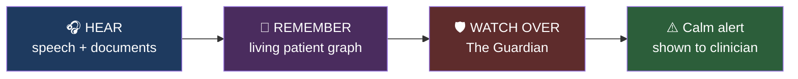
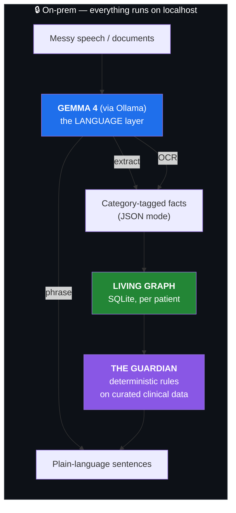

# Confide

**A second clinician in the room — powered by Gemma 4, running entirely on-prem. It never forgets, and never phones home.**


---

## The problem

Hospitals don't lose patients to exotic failures — they lose them at the **seams**, where a conversation meets the record:

- A doctor orders an NSAID for a patient already on a blood thinner. Textbook interaction; ninth patient of the shift.
- A patient says *"I'm not on any blood thinners"* while **warfarin sits on their chart** from admission. Nobody reconciles the two.
- *"Recheck troponin in 3 hours"* is dictated at 2pm and quietly forgotten by the 7pm shift change.

The information **existed** — it just wasn't cross-checked at the moment a human decided. The obvious fix ("add a cloud AI scribe") makes it worse: it ships the most sensitive audio and documents in medicine to a third party. **Confide moves the intelligence to the bedside instead of moving the data to the cloud.**

## What it does

Confide **hears** every conversation, **remembers** it in one living patient graph, and **watches over** the care — speaking up on its own when it catches a conflict.



---

## How we use Gemma 4 + local inference

One Gemma 4 model, served locally by **Ollama**, carries the entire product — reasoning **and** vision. Nothing leaves the machine.



Our one hard architectural rule:

> ### Gemma 4 is the *language* layer. It is never the *decision* layer.

| Gemma 4 does (and is great at) | Curated code does (never the model) |
|---|---|
| **Extract** facts from messy transcripts → strict JSON | Decide if a drug conflicts with an allergy |
| **OCR** consent forms & discharge sheets (multimodal — no 2nd model) | Decide if two drugs interact |
| **Ground** Q&A in the actual document text | Decide if a recheck is overdue |
| **Phrase** alerts calmly for a frightened patient | Every clinical **judgment** ([`core/curated.py`](core/curated.py)) |

**Why this makes local inference the right call — and why Gemma 4 makes it free:**

- **Removes an entire risk surface.** Audio and images never travel; there's nothing in transit to breach.
- **Works with zero connectivity** — rural clinics, ambulances, disaster zones.
- **Verifiable, not promised.** A live `NETWORK: OFF` pill + a floating **Gemma console** (prompt → JSON → latency, in real time) let you *watch* every inference run locally. Pull the Wi-Fi; it keeps working.
- **Auditable & repeatable.** Because judgment is code, identical inputs give identical alerts, each tracing to a specific rule. Gemma 4's known weakness — confidently-wrong reasoning — is *designed out*. It's small enough to serve on one box (`ollama pull gemma4`, held warm), strong enough that grammar-constrained JSON extraction is valid every time.

---

## The Guardian — the part that speaks up

From a **single dictation**, the Guardian checks the graph three ways:

| Check | Example | Result |
|---|---|---|
| 🔴 **Allergy / interaction** | Order ibuprofen for a warfarin patient | Critical bleeding-risk alert, instantly |
| 🟠 **Contradiction** | "Not on any blood thinners" vs. warfarin on file | Flagged against the admission record |
| 🟠 **Forgotten order** | "Recheck troponin in 3h" never closed | A gentle "before you go…" flag |

Alerts are persisted, flow into the shift handoff, and are **surfaced — never auto-executed.** The clinician stays in the loop.

## Quick start

```bash
git clone git@github.com:Arnav710/doctor-offline.git && cd doctor-offline
ollama pull gemma4                                   # local model
python -m venv .venv && source .venv/bin/activate
pip install -r requirements.txt
cd web && npm install && npm run build && cd ..      # build the SPA
uvicorn app:app --reload                             # open http://localhost:8000
```

Then turn off Wi-Fi and use it — dictation, OCR, Q&A, and Guardian alerts all keep working. Seeded logins: `doctor/confide`, `maria/confide`.

## Tech stack

**Gemma 4 via Ollama** (reasoning + vision) · **faster-whisper** (STT) · **Piper** (TTS) · **SQLite** (living graph) · curated clinical tables in code (swap 1:1 for RxNorm/DrugBank) · **FastAPI** + **React/Vite**, all on `localhost`.

## Contributors

Jenish Kothari · Akshay Kumar · Khushi Sidana · Arnav Modi

*Built for the Build with Gemma hackathon (On-Device AI track).*
