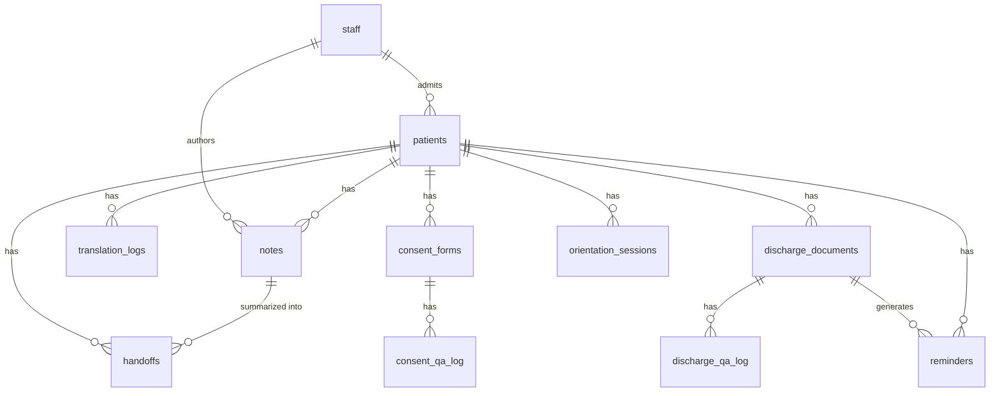

# Doctor Offline — Feature & API Specification

This document is the build contract for the backend-first implementation. It defines the data
model, every API endpoint, and how the (later, bare-bones) frontend is expected to call them.
Nothing here is final prose — it's meant to be edited as we build and hit reality.

**Scope for this pass:** all 6 build-priority features from the README —
Clinical Scribe, Real-Time Translation, Consent Explainer, Discharge Navigator,
Shift Handoff Generator, Bedside Orientation.
Order Extraction and Alarm-Fatigue Triage stay **roadmap / doc-only** — no tables, no endpoints,
no screens, per the README's own priority split.

## Decisions locked in before writing this spec

- **Model**: text-only Gemma via Ollama (e.g. `gemma2:9b` — confirm exact tag you have pulled).
- **OCR**: Tesseract (`pytesseract`), separate from the LLM.
- **Voice/image I/O**: record-then-submit. The browser records a full audio clip or captures a
  photo and POSTs it; the backend replies with a finished result. No WebSocket streaming.
- **Multi-user**: the system supports many staff and many patients. Any single *interaction*
  (a scribe session, a consent scan, a discharge Q&A) is always between exactly one logged-in
  staff member and one active patient.
- **Staff auth**: no passwords. Staff pick their name from a list and enter a short PIN.
  This is a local, single-device app — there's no server-side session token; the frontend holds
  `staff_id` (and the active `patient_id`) in `localStorage` and sends them with each request.
  This is intentionally not hardened auth; it's identity for attribution, not a security boundary.
- **Roles**: one flat `staff` role for now — any logged-in staff member can use any feature.
- **Patient selection**: explicit picker. After login, staff search/select a patient, who becomes
  the "active patient" for subsequent screens until they switch. Patients never log in themselves
  — they're a record staff attaches to, and may use the device hands-on (e.g. answering discharge
  Q&A) without ever authenticating.

---

## 1. Architecture recap

Same three primitives as the README, now with concrete module responsibilities:

```
core/voice.py    transcribe(audio_path) -> (text, detected_lang)
                 speak(text, lang) -> audio_path
core/vision.py   ocr(image_path) -> text
core/llm.py      ask_gemma(prompt, system=None) -> text   (thin Ollama wrapper)
core/db.py       SQLite connection + schema + typed helper functions per table
```

Every `features/*.py` module composes these four functions plus its own prompt templates. No
feature module talks to Ollama, Tesseract, or SQLite directly except through `core/`.

## 2. Data model

SQLite, one file (e.g. `data/doctor_offline.db`). All timestamps are ISO-8601 UTC strings.
All `*_id` foreign keys reference `.id` on the named table.

```sql
staff (
  id INTEGER PRIMARY KEY,
  name TEXT NOT NULL,
  pin_hash TEXT NOT NULL,
  created_at TEXT NOT NULL
)

patients (
  id INTEGER PRIMARY KEY,
  name TEXT NOT NULL,
  mrn TEXT UNIQUE,                 -- medical record number
  date_of_birth TEXT,
  primary_language TEXT DEFAULT 'en',
  room TEXT,
  known_allergies TEXT,            -- free text for now; structured table is roadmap (Order Extraction)
  status TEXT CHECK(status IN ('admitted','discharged')) DEFAULT 'admitted',
  admitted_at TEXT NOT NULL,
  discharged_at TEXT,
  created_by_staff_id INTEGER REFERENCES staff(id),
  created_at TEXT NOT NULL
)

notes (                             -- Clinical Scribe
  id INTEGER PRIMARY KEY,
  patient_id INTEGER REFERENCES patients(id),
  staff_id INTEGER REFERENCES staff(id),
  raw_transcript TEXT,
  chief_complaint TEXT,
  medications TEXT,                 -- JSON array of strings
  follow_ups TEXT,                  -- JSON array of strings
  status TEXT CHECK(status IN ('draft','finalized')) DEFAULT 'draft',
  created_at TEXT NOT NULL,
  updated_at TEXT NOT NULL
)

translation_logs (                  -- Real-Time Translation
  id INTEGER PRIMARY KEY,
  patient_id INTEGER REFERENCES patients(id),
  staff_id INTEGER REFERENCES staff(id),
  direction TEXT CHECK(direction IN ('patient_to_staff','staff_to_patient')),
  source_language TEXT,
  target_language TEXT,
  source_text TEXT,
  translated_text TEXT,
  created_at TEXT NOT NULL
)

consent_forms (                     -- Consent Explainer
  id INTEGER PRIMARY KEY,
  patient_id INTEGER REFERENCES patients(id),
  staff_id INTEGER REFERENCES staff(id),
  image_path TEXT NOT NULL,
  ocr_text TEXT,
  plain_language_explanation TEXT,
  suggested_questions TEXT,          -- JSON array of strings
  created_at TEXT NOT NULL
)

consent_qa_log (
  id INTEGER PRIMARY KEY,
  consent_form_id INTEGER REFERENCES consent_forms(id),
  patient_id INTEGER REFERENCES patients(id),
  question_text TEXT NOT NULL,
  answer_text TEXT NOT NULL,
  asked_at TEXT NOT NULL
)

discharge_documents (               -- Discharge Navigator
  id INTEGER PRIMARY KEY,
  patient_id INTEGER REFERENCES patients(id),
  staff_id INTEGER REFERENCES staff(id),
  image_path TEXT NOT NULL,
  ocr_text TEXT,
  red_flags TEXT,                    -- JSON array of {symptom, description}
  created_at TEXT NOT NULL
)

discharge_qa_log (
  id INTEGER PRIMARY KEY,
  discharge_document_id INTEGER REFERENCES discharge_documents(id),
  patient_id INTEGER REFERENCES patients(id),
  question_text TEXT NOT NULL,
  answer_text TEXT NOT NULL,
  is_red_flag INTEGER NOT NULL DEFAULT 0,   -- 0/1, did this question match a listed red flag
  asked_at TEXT NOT NULL
)

reminders (
  id INTEGER PRIMARY KEY,
  patient_id INTEGER REFERENCES patients(id),
  discharge_document_id INTEGER REFERENCES discharge_documents(id),
  description TEXT NOT NULL,
  remind_at TEXT NOT NULL,
  status TEXT CHECK(status IN ('pending','done','dismissed')) DEFAULT 'pending',
  created_at TEXT NOT NULL
)

handoffs (                           -- Shift Handoff Generator
  id INTEGER PRIMARY KEY,
  patient_id INTEGER REFERENCES patients(id),
  staff_id INTEGER REFERENCES staff(id),
  situation TEXT,
  background TEXT,
  assessment TEXT,
  recommendation TEXT,
  source_note_ids TEXT,               -- JSON array of note ids folded into this summary
  created_at TEXT NOT NULL
)

orientation_sessions (               -- Bedside Orientation
  id INTEGER PRIMARY KEY,
  patient_id INTEGER REFERENCES patients(id),
  staff_id INTEGER REFERENCES staff(id),
  script_text TEXT NOT NULL,
  audio_path TEXT,
  created_at TEXT NOT NULL
)
```



## 3. Cross-cutting API conventions

- Base path: `/api`. All request/response bodies are JSON except file uploads
  (`multipart/form-data`).
- Every write endpoint that represents an action by a staff member takes `staff_id` (from
  localStorage, sent as a form/body field) — the backend does not infer identity from a
  cryptographic session.
- File uploads (audio, images) are stored under `data/media/{audio|images}/{uuid}.{ext}` and
  served back at `/media/{...}` via a FastAPI static mount. Endpoints store the path, not blobs,
  in SQLite.
- Standard error shape: `{"error": "message"}` with an appropriate 4xx/5xx status.
- `GET /api/status` — `{ "network_reachable": bool, "ollama_reachable": bool, "model": str }`.
  `network_reachable` is a best-effort short-timeout socket probe to a public DNS IP; it powers
  the "NETWORK: OFF" indicator in the UI and is the literal proof-of-offline demo step.

## 4. Feature specs

### 4.0 Staff & Patients (foundational, not a demo "feature" but required by all of them)

**Flow:** Staff opens the app → picks their name from a list → enters PIN → picked up as
`staff_id`. They then search/select an admitted patient (or admit a new one) → that patient's
`id` becomes the active patient for every subsequent screen until changed.

**Endpoints**

| Method & path | Purpose | Request | Response |
|---|---|---|---|
| `GET /api/staff` | list staff for the login picker | — | `[{id, name}]` (no pin_hash) |
| `POST /api/staff` | register a new staff member (local device, no gating) | `{name, pin}` | `{id, name}` |
| `POST /api/auth/login` | verify PIN | `{staff_id, pin}` | `{staff_id, name}` or 401 |
| `GET /api/patients?status=&search=` | roster / search for the patient picker | query params | `[{id, name, mrn, room, status}]` |
| `POST /api/patients` | admit a new patient | `{name, mrn, date_of_birth, primary_language, room, known_allergies, staff_id}` | full patient object |
| `GET /api/patients/{id}` | patient detail (header context on every feature screen) | — | full patient object |
| `PUT /api/patients/{id}` | edit patient info | partial patient fields | full patient object |
| `POST /api/patients/{id}/discharge` | mark discharged | `{staff_id}` | full patient object |

**Frontend:** `LoginScreen`, `PatientPickerScreen` (search + "admit new" form), `TopBar`
(persistent — shows staff name, active patient name/room, network status pill, "switch patient" /
logout controls). Every other screen reads `staff_id` + active `patient_id` from `localStorage`
and renders `TopBar` above its own content.

---

### 4.1 Clinical Scribe (Rounds)

**Flow:** staff opens Scribe for the active patient → records dictation → sees a structured
draft (chief complaint / medications / follow-ups) → edits inline → saves as draft or finalizes.

**DB:** `notes`

**Endpoints**

| Method & path | Purpose | Request | Response |
|---|---|---|---|
| `POST /api/voice/transcribe` | generic STT, reused by Translation/Consent/Discharge too | audio file (multipart) | `{transcript, detected_language}` |
| `POST /api/scribe/structure` | Gemma turns a transcript into structured fields (not persisted yet) | `{transcript}` | `{chief_complaint, medications: [str], follow_ups: [str]}` |
| `POST /api/notes` | persist a note (draft or finalized) | `{patient_id, staff_id, raw_transcript, chief_complaint, medications, follow_ups, status}` | full note object |
| `GET /api/notes?patient_id=` | history for a patient (also feeds Handoff) | — | `[note]` |
| `GET /api/notes/{id}` | one note | — | note object |
| `PUT /api/notes/{id}` | edit fields and/or finalize | partial fields incl. `status` | note object |

**Frontend:** `ScribeScreen` — record button → `POST /voice/transcribe` → `POST
/scribe/structure` → editable form pre-filled with the three fields → "Save draft" / "Finalize"
→ `POST /notes` or `PUT /notes/{id}`. A collapsible "past notes" list below, `GET
/notes?patient_id=`.

---

### 4.2 Real-Time Translation (Admission)

Turn-based, not streaming: each button press is one spoken utterance in one direction.

**DB:** `translation_logs` (a running log of the conversation, not required for the feature to
function, but gives staff a reviewable transcript of what was actually said).

**Endpoints**

| Method & path | Purpose | Request | Response |
|---|---|---|---|
| `POST /api/translate/turn` | one translated utterance | audio file + `{patient_id, staff_id, direction, target_language}` | `{source_text, source_language, translated_text, target_language, audio_url}` |
| `GET /api/translate/logs?patient_id=` | conversation history | — | `[translation_log]` |

Internally: `voice.transcribe` → `llm.ask_gemma` (translate prompt) → `voice.speak` → row
inserted into `translation_logs`.

**Frontend:** `TranslationScreen` — a direction toggle (Patient → Staff / Staff → Patient), one
record button, the last exchange shown as source/translated text pairs with the translated audio
auto-playing, and a scrollback of `translate/logs` below.

---

### 4.3 Consent Explainer (Consent)

**Flow:** staff photographs the consent form → OCR + Gemma produce a plain-language explanation
and a list of likely questions → the patient asks questions aloud → each is transcribed,
answered (grounded in the form's OCR text), and logged.

**DB:** `consent_forms`, `consent_qa_log`

**Endpoints**

| Method & path | Purpose | Request | Response |
|---|---|---|---|
| `POST /api/consent/forms` | ingest a form photo | image file + `{patient_id, staff_id}` | `{id, ocr_text, plain_language_explanation, suggested_questions}` |
| `GET /api/consent/forms?patient_id=` | list forms for a patient | — | `[consent_form]` |
| `GET /api/consent/forms/{id}` | one form, incl. Q&A log | — | `{...form, qa_log: [...]}` |
| `POST /api/consent/forms/{id}/questions` | ask a question about this form | audio file **or** `{question_text}`, `{patient_id}` | `{question_text, answer_text}` |
| `GET /api/consent/forms/{id}/questions` | Q&A history | — | `[consent_qa_log]` |

Grounding rule: the answer prompt always includes the form's stored `ocr_text` as context —
never answered from the model's own "knowledge."

**Frontend:** `ConsentScreen` — photo capture/upload → shows OCR text (collapsible, for
verification) + plain-language explanation card + suggested-questions chips (tap-to-ask
shortcuts) → record-a-question button → running Q&A list underneath.

---

### 4.4 Discharge Navigator (Discharge)

**Flow:** staff uploads discharge papers → OCR + Gemma extract a red-flag symptom list → patient
asks grounded Q&A → staff/patient can schedule follow-up reminders.

**DB:** `discharge_documents`, `discharge_qa_log`, `reminders`

**Endpoints**

| Method & path | Purpose | Request | Response |
|---|---|---|---|
| `POST /api/discharge/documents` | ingest discharge papers | image file + `{patient_id, staff_id}` | `{id, ocr_text, red_flags: [{symptom, description}]}` |
| `GET /api/discharge/documents?patient_id=` | list for a patient | — | `[discharge_document]` |
| `GET /api/discharge/documents/{id}` | one doc, incl. Q&A log | — | `{...doc, qa_log: [...]}` |
| `POST /api/discharge/documents/{id}/questions` | grounded Q&A (also flags red-flag matches) | audio file **or** `{question_text}`, `{patient_id}` | `{question_text, answer_text, is_red_flag}` |
| `GET /api/discharge/documents/{id}/questions` | Q&A history | — | `[discharge_qa_log]` |
| `POST /api/discharge/documents/{id}/reminders` | schedule a follow-up | `{description, remind_at}` | reminder object |
| `GET /api/reminders?patient_id=&status=` | reminders dashboard | — | `[reminder]` |
| `PUT /api/reminders/{id}` | mark done/dismissed or reschedule | partial fields | reminder object |

**Frontend:** `DischargeScreen` — photo upload → red-flag list card (always visible reference) +
OCR text (collapsible) → ask-a-question (voice or typed) → answer shown with a red-flag badge
when `is_red_flag` is true → "add reminder" mini-form → reminders list widget, also surfaced on
the patient `Dashboard`.

---

### 4.5 Shift Handoff Generator (Shift change)

Reuses the Scribe pipeline's output — no new capture UI, just synthesis.

**DB:** `handoffs` (reads from `notes`)

**Endpoints**

| Method & path | Purpose | Request | Response |
|---|---|---|---|
| `POST /api/handoff` | generate an SBAR summary from this patient's notes since the last handoff (or all notes if none exists yet) | `{patient_id, staff_id}` | handoff object |
| `GET /api/handoff?patient_id=` | history | — | `[handoff]` |
| `GET /api/handoff/{id}` | one handoff | — | handoff object |

**Frontend:** `HandoffScreen` — a single "Generate Handoff" button → renders the four SBAR
sections as read-only cards → a list of prior handoffs below.

---

### 4.6 Bedside Orientation (Bedside)

**Flow:** staff taps "orient patient" → Gemma phrases day/location/reason-for-stay/what's-next
gently, pulling from the patient record and their latest note → Piper speaks it.

**DB:** `orientation_sessions` (caches the last script so it can be replayed without
regenerating)

**Endpoints**

| Method & path | Purpose | Request | Response |
|---|---|---|---|
| `POST /api/orientation/{patient_id}/generate` | build + speak a fresh orientation script | `{staff_id}` | `{script_text, audio_url}` |
| `GET /api/orientation/{patient_id}/latest` | replay the last one without regenerating | — | `{script_text, audio_url}` or 404 |

Inputs folded into the prompt: patient name, today's date, `room`, most recent note's
`chief_complaint` (reason for stay), and the next `pending` reminder if any (what's next).

**Frontend:** `OrientationScreen` — one "Play Orientation" button, the script shown as text while
the audio plays, and a "replay last" link.

---

## 5. Frontend map (bare-bones, vanilla HTML/CSS/JS — no build step)

Single `web/index.html` + a small JS router that swaps a `<main>` content area between screens,
matching the README's existing `web/` plan. No framework; `fetch()` directly against `/api`.

```
TopBar (persistent: staff name, active patient, network pill, switch/logout)
 └─ LoginScreen        → GET /staff, POST /auth/login
 └─ PatientPickerScreen → GET /patients, POST /patients
 └─ Dashboard (active patient home) → GET /patients/{id}, GET /reminders?patient_id=, GET /notes?patient_id=
      ├─ ScribeScreen
      ├─ TranslationScreen
      ├─ ConsentScreen
      ├─ DischargeScreen
      ├─ HandoffScreen
      └─ OrientationScreen
```

Each feature screen is a self-contained JS module (`web/js/scribe.js`, etc.) that owns its DOM
fragment and its own `fetch` calls — no shared state beyond `staff_id` / `patient_id` read from
`localStorage` and the currently active patient object cached in memory.

## 6. Full endpoint reference

```
GET    /api/status
GET    /api/staff
POST   /api/staff
POST   /api/auth/login
GET    /api/patients
POST   /api/patients
GET    /api/patients/{id}
PUT    /api/patients/{id}
POST   /api/patients/{id}/discharge
POST   /api/voice/transcribe
POST   /api/scribe/structure
POST   /api/notes
GET    /api/notes
GET    /api/notes/{id}
PUT    /api/notes/{id}
POST   /api/translate/turn
GET    /api/translate/logs
POST   /api/consent/forms
GET    /api/consent/forms
GET    /api/consent/forms/{id}
POST   /api/consent/forms/{id}/questions
GET    /api/consent/forms/{id}/questions
POST   /api/discharge/documents
GET    /api/discharge/documents
GET    /api/discharge/documents/{id}
POST   /api/discharge/documents/{id}/questions
GET    /api/discharge/documents/{id}/questions
POST   /api/discharge/documents/{id}/reminders
GET    /api/reminders
PUT    /api/reminders/{id}
POST   /api/handoff
GET    /api/handoff
GET    /api/handoff/{id}
POST   /api/orientation/{patient_id}/generate
GET    /api/orientation/{patient_id}/latest
```

## 7. Explicitly out of scope (roadmap, doc-only per README)

- **Order Extraction** — no `tasks`/orders table, no endpoints, no screen.
- **Alarm-Fatigue Triage** — no tables, no endpoints, no screen.
- A structured `allergies` table — `patients.known_allergies` is free text for now; a real
  cross-check table is what Order Extraction would need, so it's deferred with it.

## 8. Suggested build order (backend first)

1. `core/db.py` — schema creation + typed helpers for every table above.
2. `core/voice.py`, `core/vision.py`, `core/llm.py` — the three primitives, independently testable.
3. Staff/patient auth + CRUD (§4.0) — everything else depends on having a staff_id and patient_id.
4. Clinical Scribe (§4.1) — establishes the record→transcribe→structure→save pattern reused
   everywhere else.
5. Consent Explainer (§4.3) and Discharge Navigator (§4.4) — establish the OCR→ground→Q&A pattern.
6. Shift Handoff (§4.5) — pure synthesis on top of existing notes, cheapest to add.
7. Real-Time Translation (§4.2) and Bedside Orientation (§4.6).
8. Bare-bones frontend wiring all of the above, screen by screen, in the same order.

---

*This spec is a living document — update it as implementation reveals gaps, rather than letting
code and doc drift apart.*
